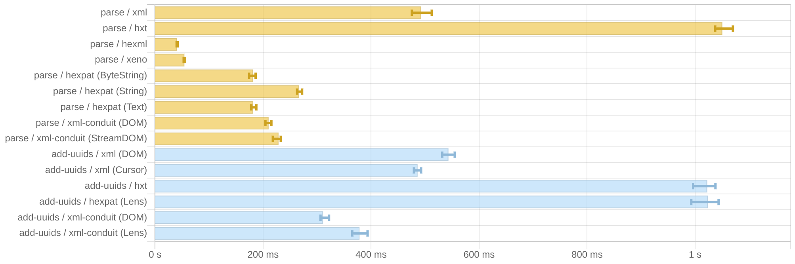

# basic-xml-benchmark-hs

Benchmark of several Haskell XML libraries against parsing [neurips2022.xml](https://github.com/dozed/basic-xml-benchmark-hs/blob/main/data/neurips2022.xml).

Example:

```xml
<?xml version="1.0" encoding="UTF-8"?>
<bib>
  <publication uuid="ab929494-2cd9-4ba0-9762-2b92781a12be">
    <title>On Kernelized Multi-Armed Bandits with Constraints.</title>
    <author uuid="fb6536ec-6108-43dd-afc4-c66784a5361b">
      <name>Xingyu Zhou</name>
    </author>
    <author uuid="c263a753-c2e2-4429-99fb-9e78490d4331">
      <name>Bo Ji</name>
    </author>
    <url>http://papers.nips.cc/paper_files/paper/2022/hash/00295cede6e1600d344b5cd6d9fd4640-Abstract-Conference.html</url>
  </publication>
  <publication uuid="fa771a3c-ddfc-42bc-b91c-3ad305e3bc9e">
    <title>Fast Bayesian Coresets via Subsampling and Quasi-Newton Refinement.</title>
    <author uuid="d583ffce-73de-4939-8ac5-0ece79b297cf">
      <name>Cian Naik</name>
    </author>
    <author uuid="f665ec49-9e91-4c90-a810-37efb498eeed">
      <name>Judith Rousseau</name>
    </author>
    <author uuid="ea7f4a22-0e56-4656-a13d-9961ff247267">
      <name>Trevor Campbell</name>
    </author>
    <url>http://papers.nips.cc/paper_files/paper/2022/hash/005413e90d003d13886019607b037f52-Abstract-Conference.html</url>
  </publication>
</bib>
```

XML libraries:
- [xml 1.3.14](https://hackage.haskell.org/package/xml-1.3.14) 
- [hxt 9.3.1.22](https://hackage.haskell.org/package/hxt-9.3.1.22)
- [hexml 0.3.4](https://hackage.haskell.org/package/hexml-0.3.4)
- [xeno 0.6](https://hackage.haskell.org/package/xeno-0.6)
- [hexpat 0.20.13](https://hackage.haskell.org/package/hexpat-0.20.13)
- [xml-conduit 1.9.1.3](https://hackage.haskell.org/package/xml-conduit-1.9.1.3)
- [xml-nodestream](https://github.com/travisbrown/xml-nodestream)

Results:



```
benchmarking tp/xml
time                 421.9 ms   (351.7 ms .. 508.4 ms)
                     0.995 R²   (0.984 R² .. 1.000 R²)
mean                 427.1 ms   (410.9 ms .. 440.1 ms)
std dev              16.22 ms   (10.27 ms .. 19.29 ms)
variance introduced by outliers: 19% (moderately inflated)

benchmarking tp/hxt
time                 960.5 ms   (814.1 ms .. 1.075 s)
                     0.997 R²   (0.991 R² .. 1.000 R²)
mean                 990.1 ms   (964.5 ms .. 1.014 s)
std dev              30.63 ms   (14.00 ms .. 41.97 ms)
variance introduced by outliers: 19% (moderately inflated)

benchmarking tp/hexml
time                 39.33 ms   (38.24 ms .. 41.17 ms)
                     0.996 R²   (0.991 R² .. 0.999 R²)
mean                 41.63 ms   (40.63 ms .. 43.66 ms)
std dev              2.922 ms   (1.302 ms .. 4.152 ms)
variance introduced by outliers: 25% (moderately inflated)

benchmarking tp/xeno
time                 51.76 ms   (50.85 ms .. 52.94 ms)
                     0.998 R²   (0.994 R² .. 1.000 R²)
mean                 52.21 ms   (51.39 ms .. 53.11 ms)
std dev              1.814 ms   (1.205 ms .. 2.490 ms)

benchmarking tp/hexpat (ByteString)
time                 172.2 ms   (159.8 ms .. 185.4 ms)
                     0.996 R²   (0.989 R² .. 1.000 R²)
mean                 178.8 ms   (174.3 ms .. 181.1 ms)
std dev              4.605 ms   (1.956 ms .. 7.212 ms)
variance introduced by outliers: 12% (moderately inflated)

benchmarking tp/hexpat (String)
time                 259.9 ms   (242.1 ms .. 283.1 ms)
                     0.996 R²   (0.990 R² .. 1.000 R²)
mean                 259.7 ms   (252.9 ms .. 270.4 ms)
std dev              11.36 ms   (6.135 ms .. 15.09 ms)
variance introduced by outliers: 16% (moderately inflated)

benchmarking tp/hexpat (Text)
time                 169.0 ms   (161.0 ms .. 191.7 ms)
                     0.990 R²   (0.968 R² .. 1.000 R²)
mean                 179.4 ms   (173.9 ms .. 187.5 ms)
std dev              9.786 ms   (6.701 ms .. 12.04 ms)
variance introduced by outliers: 13% (moderately inflated)

benchmarking tp/xml-conduit (DOM)
time                 207.9 ms   (197.7 ms .. 216.9 ms)
                     0.999 R²   (0.996 R² .. 1.000 R²)
mean                 203.4 ms   (198.2 ms .. 207.1 ms)
std dev              6.235 ms   (4.650 ms .. 8.175 ms)
variance introduced by outliers: 14% (moderately inflated)

benchmarking tp/xml-conduit (StreamDOM)
time                 233.8 ms   (227.1 ms .. 237.3 ms)
                     1.000 R²   (0.998 R² .. 1.000 R²)
mean                 231.6 ms   (229.4 ms .. 233.4 ms)
std dev              3.007 ms   (2.085 ms .. 4.184 ms)
variance introduced by outliers: 14% (moderately inflated)
```
